# Maulana Ali

Hi! My name is Maulana Ali, a passionate Undergraduate student majoring in Computer Engineering. 

- 🔭 I’m currently working on **Me, Myself, and I**

- 🌱 I’m currently learning **Mobile Development (iOS) and Wireless Communication (LoRa/LoRaWAN)**

- 💬 Ask me about **Internet of Things (IoT), Networking & Cloud, Embedded Systems, and Data**

- 📫 How to reach me: **maulanalazim5@gmail.com**

- ⚡ Fun fact: Like to talk about any Computer Science topics

<!-- - 🤔 I’m looking for help with ... -->
<!-- - 👯 I’m looking to collaborate on ** -->
<!-- - 😄 Pronouns: ... -->

#

### 🧰 Tools

#

### 📊 Stats

<!--
**maux-unix/maux-unix** is a ✨ _special_ ✨ repository because its `README.md` (this file) appears on your GitHub profile. -->
